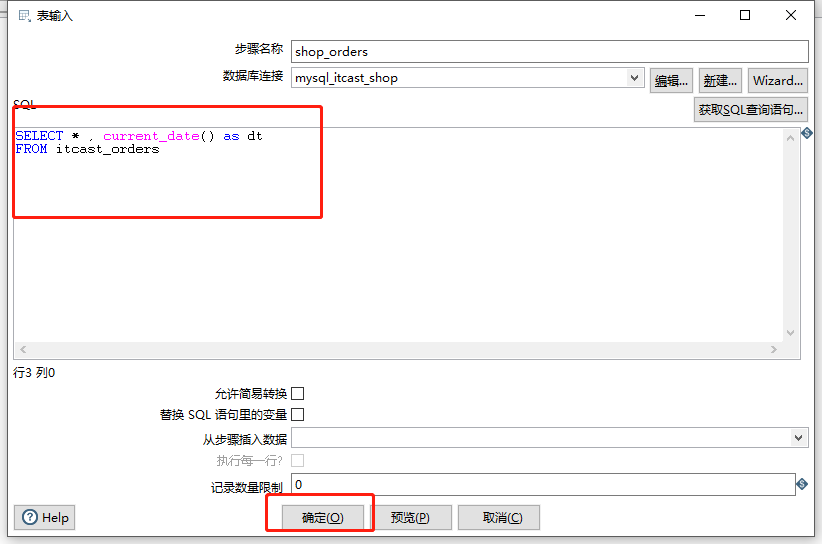
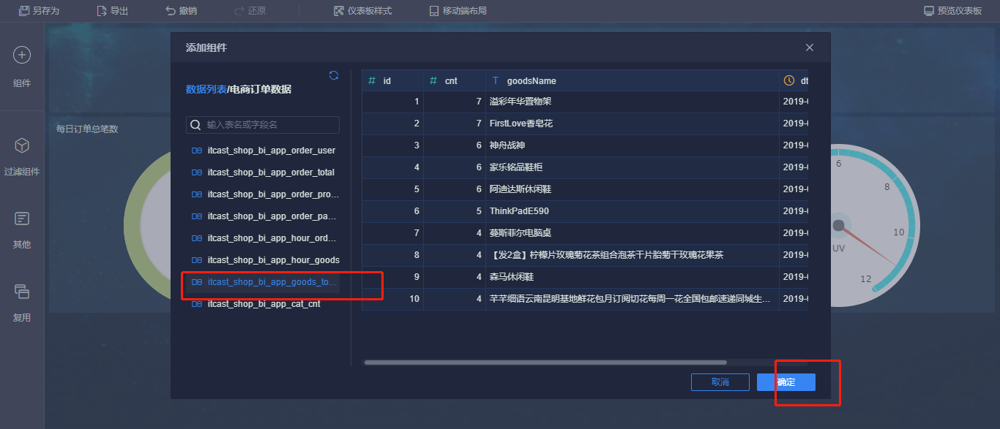

# 数据可视化分析平台FineBI

## 一、可视化的应用

### 1、数据可视化

- 可视化分析：不用写代码，直接对原始数据通过图形化操作实现分析和构建报表平台

  - 主要用于提供给业务人员快速上手实现数据分析

- 构建可视化报表

  - 通过图的形式来展示对应的数据结果，实现信息的传递

  - 传递信息的方式

    - 文字：不太适合表达数据的信息结果

    - 图片：简单直观

      - 体现数据走势
      - 体现数据大小
      - 体现数据比例

    - 声音：不太适合数据的表达

    - 视频：太笨重，不太方便

      

### 2、目的

- 通过图片来展示数据的结果，从图中可以发现数据的规律、数据中存在的问题、价值等等

- 柱状图：用于体现数据的大小

- 饼状图：用于体现数据的比例

- 曲线图：用于体现数据的走势

- 地图：用于体现不同区域的数据分布

  

### 3、工具

- 第一种：商业化可视化产品
  - 功能最全面，使用非常简单
  - 非常适合业务人员快速上手
  - 在很短的时间内快速的构建数据分析报表平台
- 第二种：开源化的可视化产品
  - 功能相对不是特别的全面
  - 使用相对需要定制化开发
- 第三种：通过代码自己开发
  - 定制化程度最高
  - 成本最高，需要大量的时间和人力来开发这个平台


## 二、商业可视化平台FineBI

### 1、介绍


FineBI 是帆软软件有限公司推出的一款商业智能（Business Intelligence）产品。
FineBI 是定位于自助大数据分析的 BI 工具，能够帮助企业的业务人员和数据分析师，开展以问题导向的探索式分析。


### 2、优势

- 通过多人协作来实现最终的可视化构建

- FineBI不需要通过复杂代码来实现开发，通过可视化操作实现开发

- 功能非常的强大

  - 适合于各种数据可视化的应用场景

  - 各种常见的分析图表

  - 支持各种各样的数据源

  - 支持处理大数据

    

### 3、部署

- 参考《FineBI Windows版本安装手册》实现安装


## 三、订单分析案例背景

### 1、电商业务

- 用户行为
  - 浏览商品
  - 登录注册
  - 添加购物车
  - 收藏商品
  - 下订单购买
- 产生数据
  - ip：用于上网的IP
  - userid：用户id
  - useragent：客户端信息：浏览器名称、版本、操作系统名称、版本
  - pid：正在访问商品 id
  - url：正在访问的页面
  - ref_url：从哪个页面进入的
  - orderId：订单id
  - payType：支付方式
  - price：支付金额
  - ……
- 电商后台分析
  - 用户分析
    - 总用户个数
    - 新增用户个数
    - 用户的来源比例
    - 用户的客户端比例
    - 流失用户
    - 回流用户
    - 跳出用户
  - 访问分析
    - 访问量最多的网页，前10名
    - 商品销量的前10名
    - 商品浏览的前10名
    - 商品收藏的前10名
  - 分析作用
    - 用于发现用户的喜好，给用户提供更好的服务
    - 用于发现整个平台存在的问题，改善平台的流程、设计、让更多的用户喜欢这个平台

### 2、订单分析

- 订单数据的生成
  - 用户在平台上下订单  =>   订单存储在这个平台的数据库中
  - 订单业务数据库：专门用于提供对于用户的订单的提交和查询
- 订单中包含的数据
  - orderid：订单id
  - userid：用户id
  - productId：商品id
  - 商品名称
  - 商品分类
  - 订单金额
  - 商品个数
  - 支付方式
  - 配送地址
  - 订单生成时间
  - ……
- 实现订单分析
  - 订单的总金额
  - 订单的总个数
  - 不同省份订单的比例
  - 退款订单的个数
  - 发货订单的个数
  - ……


## 四、案例架构及数据准备

### 1、整体架构


- 业务订单数据

  - MySQL数据库：itcast_shop
  - 用于对外支撑业务：下订单、查询订单

- ETL

  - Kettle：过滤、转换、补全

- 待分析的数据

  - MySQL数据库：itcast_shop_bi
  - 用于实现数据分析：订单分析

- 分析的结果

  - MySQL实现分析：itcast_shop_bi

  - FineBI：实现可视化报表构建

    

### 2、数据准备

- 将业务订单数据导入到MySQL中

  - step1：找到数据对应的SQL文件

    

  - step2：将这个文件拖入DataGrip中

    

  - step3：运行这个文件

    

    

  - 等待上面运行结束

    

    

    

    

    

  - 创建用于分析的数据库

    ```
    create database if not exists itcast_shop_bi  DEFAULT CHARACTER SET utf8;
    ```

    

    

- 观察原始业务数据库itcast_shop中每张表的功能以及内容

  | **表名**            | **说明**                                                     |
  | ------------------- | ------------------------------------------------------------ |
  | itcast_areas        | 用于存储地址：省份、城市、地区【区、县】                     |
  | itcast _goods       | 商品表，记录了所有商品信息：id、名称、价格、上架时间、三级分类 |
  | itcast _goods_cats  | 商品分类：商品一级、二级、三级                               |
  | itcast _orders      | 订单表，记录了所有订单信息：订单id、用户id、订单金额         |
  | itcast _order_goods | 订单商品表：记录了订单与商品的关系：订单id、商品id           |
  | itcast _users       | 用户表，记录了所有用户的信息：用户id、用户名称等             |

  - itcast_areas  ：行政地区表

    - areaId：地区id
    - parentId：这个地区的上一个级别的地区的id
      - 每个城市必然属于某个省份
      - 每个县或者区必然属于某个城市
    - areaName：地区名称
    - areaType：地区的级别
      - 0：省级
      - 1：市级
      - 2：县级或者区级

  - itcast _goods  ：商品表

    - goodsId：商品的唯一编号id
    - goodsName：商品名称
    - goodsCatId：商品最后一级分类的Id
    - saleTime：销售时间
    - createTime：上架时间

  - itcast _goods_cats

    - catId：分类id

    - parentId：父分类的id

      - 一级分类
        - 水果
      - 二级分类：属于某个一级分类
        - 进口水果
      - 三级分类：属于某个二级分类
        - 橙子类
      - 商品
        - 澳橙
        - 美国橙子

    - catName：分类名称

    - cat_level：分类级别

      - 1：一级

        

        

      - 2：二级

        

        

      - 3：三级

        

        

  - itcast _orders：订单表

    - orderId：订单Id
    - userId：用户Id
    - realTotalMoney：实际价格
    - payType：支付方式
    - createTime：订单时间

  - itcast _order_goods：订单商品表

    - orderId：订单id
    - goodsId：商品id
    - goodsNumber：个数
    - goodsPrice：价格
    - payPrice：支付价格

  - itcast _users ：用户表

    - userid：用户id
    - loginName：登录的昵称


### 3、Kettle实现ETL


- 需求：将itcast_shop数据库中每张表的最新数据同步到itcast_shop_bi中，每天同步一次
  - 每天分析昨天的数据
    - 昨天的最新数据存储itcast_shop数据库中
    - 将最新的数据同步到itcast_shop_bi中用于分析
  - 每天在分析之前，先同步一次
  - 用Kettle实现：每天自动同步itcast_shop中最新的数据存入itcast_shop_bi中


- 演示：以订单表为例

  - step1：先构建一个转换任务：读取itcast_shop中订单表数据，写入itcast_shop_bi中ods_itcast_orders

    

  - step2：配置输入，构建输入数据库连接

    

    

    

    

    

    

    

  - step3：配置输出

    

    

    

    

    

    

    

    

    

    

    

    - step4：测试运行

      

      

      

      

    - step5：构建作业，每天执行一次

      - 先创建作业

        

      - 配置转换

        

        

      - 配置定时运行：每天00：05同步一次

        

### 4、直接导入ETL以后的数据

- 删除itcast_shop_bi中的表

  ```
  drop table itcast_shop_bi.ods_itcast_orders;
  ```

  

- 找到对应的SQL文件

  

- 拖入DataGrip中，运行

  

  

  

  


## 五、MySQL分析开发

### 1、每日订单总额/总笔数分析

- 需求：统计每天的订单的总金额和总个数

- 分析：对订单表的数据进行统计

  - id：自动增长的一个数字，唯一标识一条数据，从1开始
    - 第一条数据：1
    - 第二条数据：2
  - dt：日期
  - total_money：总金额
  - total_cnt：总个数

- 创建结果表：app_order_total

  ```sql
  create table app_order_total(
      id int primary key auto_increment,
      dt date,
      total_money double,
      total_cnt int
  );
  ```

- 实现分析

  - substring：截取数据
  - round：指定保留几位小数

  ```sql
  select
    substring(createTime,1,10) as dt,
    round(sum(realTotalMoney),2) as total_money,
    count(orderId) as total_cnt
  from
    ods_itcast_orders
  where
    substring(createTime,1,10) = '2019-09-05'
  group by
    substring(createTime,1,10);
  ```

  

- 保存结果

  ```sql
  insert into app_order_total
  select
    null,
    substring(createTime,1,10) as dt,
    round(sum(realTotalMoney),2) as total_money,
    count(orderId) as total_cnt
  from
    ods_itcast_orders
  where
    substring(createTime,1,10) = '2019-09-05'
  group by
    substring(createTime,1,10);
  ```

- 结果

  

  

### 2、下订单用户总数分析

- 需求：统计所有下订单的用户的总个数

- 分析

  - 基于订单表进行分析
  - 订单表中：订单对应的用户id
  - 对订单表中的用户id去重统计个数

- 实现

  ```sql
  select
      substring(createTime,1,10) as dt,
      count(distinct userId) as total_user_cnt
  from
      ods_itcast_orders
  group by
      substring(createTime,1,10);
  ```

  

- 建表

  ```sql
  create table app_order_user(
      id int primary key auto_increment,
      dt date,
      total_user_cnt int
  );
  ```

  

- 保存

  ```sql
  insert into app_order_user
  select
      null,
      substring(createTime,1,10) as dt,
      count(distinct userId) as total_user_cnt
  from
      ods_itcast_orders
  group by
      substring(createTime,1,10);
  ```

  

- 结果

  

  

### 3、 热门商品top10

- 需求：统计所有订单中哪些商品被购买的次数最多的前10名

- 分析

  - 统计每个商品对应的订单个数
  - 按照个数降序排序
  - 取前10 
  - 结果：
    - 商品名称      订单个数
  - 订单商品表中：订单id、商品id
  - 商品表：商品id、商品名称
  - 用商品id做关联，统计每个商品对应的订单个数

- 实现

  ```sql
  select
     substring(a.createtime,1,10) as dt,
     b.goodsName,
     count(*) as cnt
  from
      ods_itcast_order_goods a join ods_itcast_goods b  on  a.goodsId = b.goodsId
  group by
      b.goodsName,substring(a.createtime,1,10)
  order by
      cnt desc
  limit 10;
  ```

  

- 建表

  ```sql
  create table app_goods_top10(
      id int primary key auto_increment,
      dt date,
      goodsName varchar(100),
      cnt int
  );
  ```

  

- 保存

  ```sql
  insert  into app_goods_top10
  select
     null,
     substring(a.createtime,1,10) as dt,
     b.goodsName,
     count(*) as cnt
  from
      ods_itcast_order_goods a join ods_itcast_goods b  on  a.goodsId = b.goodsId
  group by
      b.goodsName,substring(a.createtime,1,10)
  order by
      cnt desc
  limit 10;
  ```

  

- 结果

  

  

  

### 4、每天每小时上架商品个数 

- 需求：统计每天每个小时上架的商品个数

- 分析：根据商品上架时间进行分组统计

  - 商品表

- 实现

  ```sql
  select
      substring(createTime,1,10) as daystr,
      substring(createTime,12,2) as hourstr,
      count(*) cnt
  from
      ods_itcast_goods
  group by
      substring(createTime,1,10),substring(createTime,12,2)
  order by daystr,hourstr;
  ```

  

- 建表

  ```sql
  create table app_hour_goods(
      id int primary key auto_increment,
      daystr date,
      hourstr varchar(10),
      cnt int
  );
  ```

  

- 保存

  ```sql
  insert  into app_hour_goods
  select
      null,
      substring(createTime,1,10) as daystr,
      substring(createTime,12,2) as hourstr,
      count(*) cnt
  from
      ods_itcast_goods
  group by
      substring(createTime,1,10),substring(createTime,12,2)
  order by daystr,hourstr;
  ```

  

- 结果

  

  

  

### 5、每天每小时订单笔数 

- 需求：统计每天每个小时订单的个数

- 分析：统计订单表

  - 对天和小时分组
  - 统计订单id的个数

- 实现

  ```sql
  select
      substring(createTime,1,10) as daystr,
      substring(createTime,12,2) as hourstr,
      count(orderId) as cnt
  from
     ods_itcast_orders
  group by
     substring(createTime,1,10),substring(createTime,12,2)
  order by
     daystr,hourstr;
  ```

  

- 建表

  ```sql
  create table app_hour_orders(
      id int primary key auto_increment,
      daystr date,
      hourstr varchar(10),
      cnt int
  );
  ```

  

- 保存

  ```sql
  insert  into app_hour_orders
  select
      null,
      substring(createTime,1,10) as daystr,
      substring(createTime,12,2) as hourstr,
      count(orderId) as cnt
  from
     ods_itcast_orders
  group by
     substring(createTime,1,10),substring(createTime,12,2)
  order by
     daystr,hourstr;
  ```

  

- 结果

  

  


### 6、每天不同支付方式订单总额/订单笔数

- 需求：统计每天不同的支付方式对应的订单总金额以及订单总笔数

- 分析：订单表中有支付方式这一列

  - 现金
  - 支付宝
  - 微信
  - ……
  - 按照日期和支付方式分组统计总金额和总笔数

- 实现

  - case  when：做判断，根据这一列的值不同，可以显示不同 内容
    - case  列 
      - when  v1  then   r1
      - when  v2  then r2
      - ……
      - else   rN
      - end

  ```
  select
      substring(createTime,1,10) as dt,
      case payType when 1 then '支付宝' when 2 then '微信' when 3 then '现金' else '其他' end as pay_type,
      round(sum(realTotalMoney),2) as total_money,
      count(orderId) as total_cnt
  from
      ods_itcast_orders
  group by
      substring(createTime,1,10),
      payType;
  ```

  

- 建表

  ```
  create table app_order_paytype(
      id int primary key auto_increment,
      dt date,
      pay_type varchar(100),
      total_money double,
      total_cnt int
  );
  ```

  

- 保存

  ```
  insert into app_order_paytype
  select
      null,
      substring(createTime,1,10) as dt,
      case payType when 1 then '支付宝' when 2 then '微信' when 3 then '现金' else '其他' end as pay_type,
      round(sum(realTotalMoney),2) as total_money,
      count(orderId) as total_cnt
  from
      ods_itcast_orders
  group by
      substring(createTime,1,10),
      payType;
  ```

  

- 结果

  

  


### 7、每天各省份订单总金额、订单总笔数  

- 需求：统计每天每个省份的订单总金额以及订单总个数

- 分析：需要按照天和省份分组统计金额和个数

  - 订单表：订单金额、订单id、订单日期、areaId：省份id
  - 地区表：地区id、地区名称
  - 两张表关联

- 实现

  ```
  select
      substring(a.createTime,1,10) as dt,
      b.areaName,
      round(sum(realTotalMoney)) as total_money,
      count(orderId) as total_cnt
  from
      ods_itcast_orders a join ods_itcast_area b on a.areaId = b.areaId
  group by
      substring(a.createTime,1,10),b.areaName;
  ```

  

- 建表

  ```
  create table app_order_province(
      id int primary key auto_increment,
      daystr date,
      province varchar(100),
      total_money double,
      total_cnt int
  );
  ```

  

- 保存

  ```
  insert into app_order_province
  select
      null,
      substring(a.createTime,1,10) as dt,
      b.areaName,
      round(sum(realTotalMoney)) as total_money,
      count(orderId) as total_cnt
  from
      ods_itcast_orders a join ods_itcast_area b on a.areaId = b.areaId
  group by
      substring(a.createTime,1,10),b.areaName;
  ```

  

- 结果


### 8、每天不同商品分类订单个数统计

- 需求：统计每天不同商品分类对应订单的个数

- 分析

  - 订单商品表：订单id、商品id   =>  统计订单个数
  - 商品表：商品id、商品分类id
  - 商品分类表：商品分类id、商品分类名称 

- 实现

  ```sql
  select
      substring(a.createtime,1,10) as daystr,
      c.catName,
      count(*) as cnt
  from
       ods_itcast_order_goods a join ods_itcast_goods b  on a.goodsId = b.goodsId
       join ods_itcast_good_cats c on b.goodsCatId =c.catId
  group by
       substring(a.createtime,1,10),c.catName;
  ```

  

- 建表

  ```sql
  create table app_cat_cnt(
      id int primary key auto_increment,
      daystr date,
      catName varchar(100),
      cnt int
  );
  
  ```

  

- 保存

  ```sql
  insert  into app_cat_cnt
  select
      null,
      substring(a.createtime,1,10) as daystr,
      c.catName,
      count(*) as cnt
  from
       ods_itcast_order_goods a join ods_itcast_goods b  on a.goodsId = b.goodsId
       join ods_itcast_good_cats c on b.goodsCatId =c.catId
  group by
       substring(a.createtime,1,10),c.catName;
  ```

  

- 结果

  

  


## 六、FineBI实现可视化

### 1、启动登录


### 2、构建连接


```
数据连接名称：itcast_shop_bi
数据库名称：itcast_shop_bi
主机：localhost
端口3306
用户名：root
密码：123456
数据连接URL：jdbc:mysql://localhost:3306/itcast_shop_bi?useUnicode=true&characterEncoding=utf8
```


### 3、配置数据


### 4、构建仪表盘


### 5、添加图表

- 添加标题

  

  

- 每日订单总个数

  

  

  

  

  

  

  ​		

  

  

  

  

  

  

- 每日订单总金额

  

  

  

  

  

- 每日订单用户数

  

  

  

  

  


- 热门商品Top10

  

  

  

  

  

  


- 每小时上架商品个数

  

  

  

  

  

  

  


- 每小时订单个数

  

  

  

  

  

  


- 用户支付方式倾向

  

  

  

  

  

  


- 不同支付方式的订单金额比例

  

  

  

  


- 各省份的订单金额及订单个数

  

  

  

  

  

  

  

  

  

  

  


- 商品分类词云图

  

  

  

  

  

  

  

  


